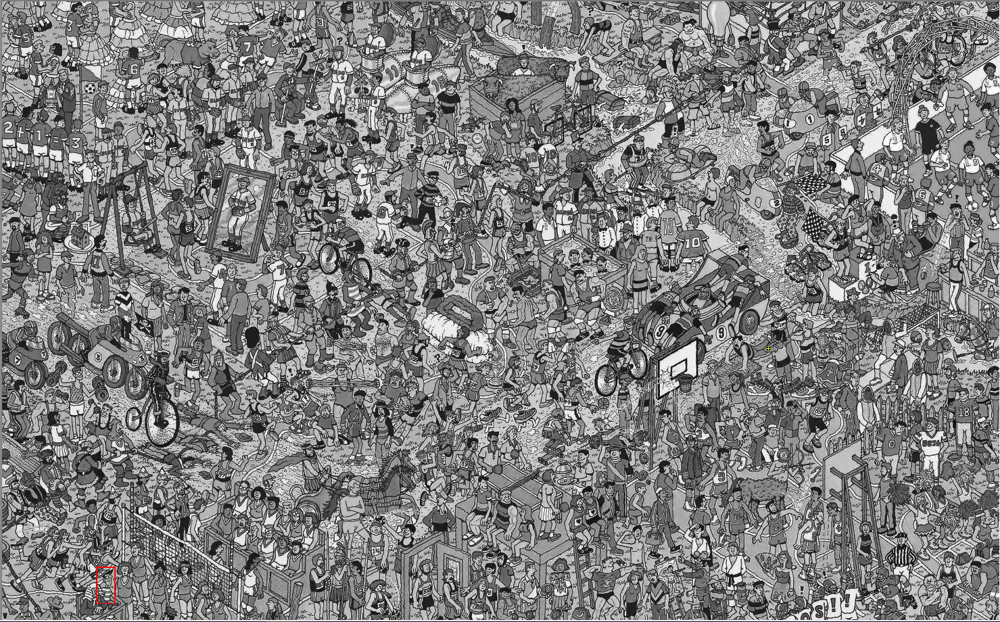

# FindingWaldo
A  program that finds Waldo given a image of Waldo and the search image to search in. This is written in Jython - Python programming language written in Java

## Output: Small Waldo:

## Output: Big Waldo:

